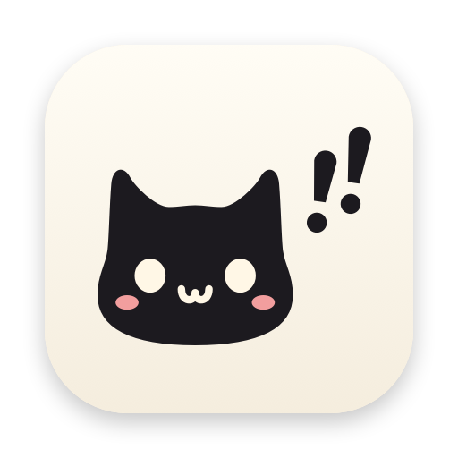
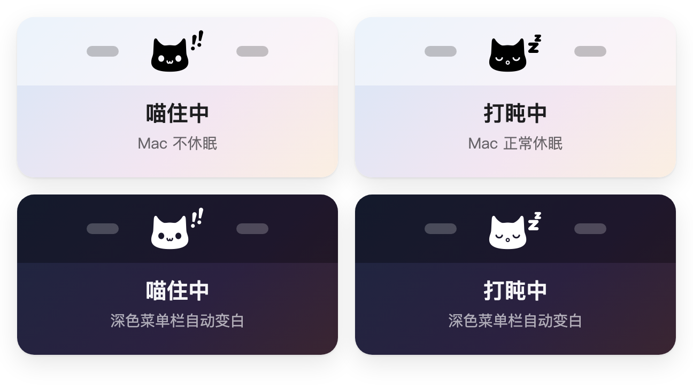
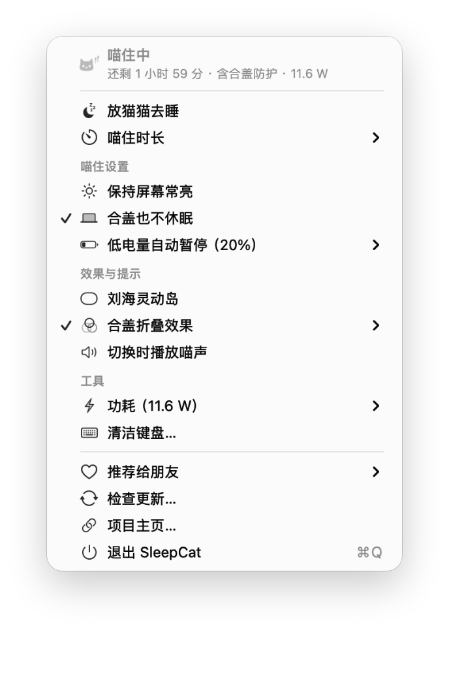
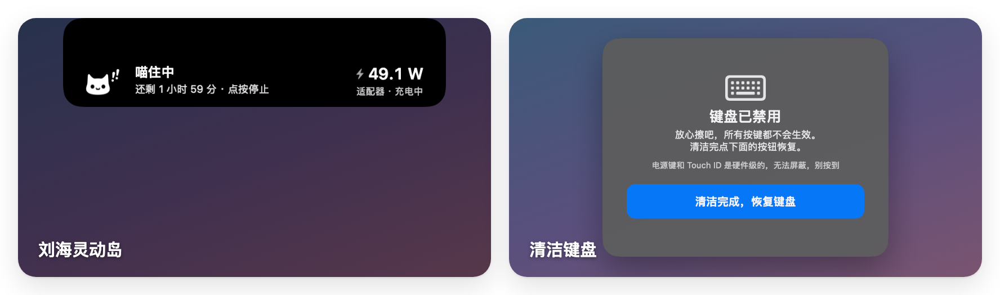

<p align="center">
  
</p>

<h1 align="center">SleepCat</h1>

<p align="center">
  菜单栏里的一只猫猫，喵住你的 Mac 不让它休眠，连合盖都能挡住。<br>
  A cat in your menu bar that keeps your Mac awake — including with the lid closed.
</p>

<p align="center">
  <a href="https://github.com/SuInk/sleepcat/releases/latest"></a>
  
  
</p>

<p align="center">
  
</p>

**一行命令安装**（打开「终端」粘贴运行，不需要 Homebrew）：

```sh
curl -fsSL https://raw.githubusercontent.com/SuInk/sleepcat/main/install.sh | bash
```

其他安装方式（Homebrew、直接下载、源码构建）见[安装](#安装)。

## 功能

<p align="center">
  <picture>
    <source media="(prefers-color-scheme: dark)" srcset="docs/images/menu-dark.png">
    
  </picture>
</p>

- **左键点猫猫**：一键开关防休眠（IOKit 电源断言，和 `caffeinate` 同机制）
- **右键菜单**：
  - ⏰ 喵住时长：30 分钟 ~ 8 小时（每档显示结束时间）/ 无限期 / 自定义
  - 🔋 **低电量自动暂停**：用电池时电量低于 20%（可改 10% / 30% / 关闭）持续 1 分钟，就暂停喵住、恢复合盖休眠，避免塞进包里把电耗光；**插上电源会自动恢复**（定时的会接着剩余时间）。插着电源不会暂停，充电器一时带不动、短暂切到电池几秒也不会误停。电量已经很低时手动开启喵住，这一轮不会被暂停。暂停和恢复时会发系统通知（第一次会请求通知权限；关掉了的话，菜单「低电量自动暂停」里有入口打开）
  - 🔄 **检查更新**：菜单里手动检查，默认每天自动查一次（发现新版本弹个提示，可在检查更新的弹窗里关掉）；用 Homebrew 装的会给出 `brew upgrade` 命令
  - 💌 **推荐给朋友**：一键复制推荐语和链接（发微信 / QQ）、复制一行 Homebrew 安装命令，或调出系统分享面板
  - ⚡️ **功耗曲线和记录**：菜单里实时显示整机功耗（读 SMC 的 PSTR，插电和用电池都准），子菜单带一条迷你曲线，跨度可选 1 / 6 / 24 小时；点「功耗曲线…」打开窗口看细节（当前值、平均 / 峰值 / 最低、本次喵住和今天的用电）。采样每分钟落一次盘，重启、更新之后曲线还接得上；应用没开或 Mac 睡着的那几段会留白，不会补成直线。喵住结束时还会往 `~/Library/Application Support/SleepCat/功耗记录.csv` 记一行（时长、用电量、平均和峰值功耗），用表格软件能直接打开
  - ⌨️ **清洁键盘**：暂时禁用所有按键（含亮度音量等功能键），屏幕中央弹出面板，点「清洁完成」恢复。需要「辅助功能」权限
  - 🔒 **合盖也不休眠**：用 `pmset disablesleep` 挡住合盖强制休眠
  - 同时保持屏幕常亮（可选，默认只防系统休眠）
  - 音效：喵（代码合成）/ 呼噜（默认关闭）
- 🏝️ **Duo 岛**：把 MacBook 刘海当灵动岛用（iPhone Duo 风格）——平时隐身，鼠标悬停到刘海或喵住状态变化时流畅展开成黑色胶囊，显示猫猫状态和剩余时间，点按直接切换；菜单可关
- 🌫️ **Duo 合盖折叠**：读取 MacBook 内置的铰链角度传感器（HID Sensor 0x20/0x8A），合盖时**画面停在原处、屏幕从画面里转过去**——和 iPhone Duo 的折叠转场同一套做法：把内建屏幕实时截下来，按视点做透视重投影，远边渐进模糊（最大半径 120pt）并渐隐到黑，铰链边始终清晰。角度用临界阻尼弹簧平滑（ω=14），盖子一动按 60 帧跟手，摊开不动时降到 10 帧省电。需要**屏幕录制权限**（菜单里有一步到位的入口）；没授权时退回简化的毛玻璃效果，一样能用。盖子停在半路、合到底都保持；只有屏幕正被远程控制 / 屏幕共享 / 录屏持续监看时才自动让开。只画在内建屏幕上。调试：`SleepCat --lid-angle` 打印实时角度，`SleepCat --blur-sweep` 模拟一次合盖，`SleepCat --fold-bench` 量渲染耗时
<p align="center">
  
</p>

- 模板图标，自动适配深浅色菜单栏；按住 ⌘ 拖动可调整猫猫在菜单栏里的位置（位置会记住）
- 喵住会一直保留：退出应用、更新、崩溃、重启 Mac 之后再打开，会接着喵（定时已经到点的除外）；只有你亲手「放猫猫去睡」才算结束。应用关着的时候不管休眠，Mac 照常睡

## 安装

需要 **macOS 13 Ventura 及以上**，Apple Silicon 和 Intel 都支持。下面几种方式任选一种。

### 方式一：一行命令安装（推荐）

不需要 Homebrew，打开「终端」粘贴运行：

```sh
curl -fsSL https://raw.githubusercontent.com/SuInk/sleepcat/main/install.sh | bash
```

脚本会自动下载最新版、核对校验值、放进「应用程序」并打开，第一次打开也不会被系统拦下。以后升级也是再运行一次这行，设置和授权都会保留。脚本内容就是仓库里的 [install.sh](install.sh)，可以先看一眼再运行。

需要的话可以加参数（写在 `bash` 前面）：

```sh
# 装指定版本
curl -fsSL https://raw.githubusercontent.com/SuInk/sleepcat/main/install.sh | SLEEPCAT_VERSION=1.1.0 bash
# 装到自己的「应用程序」目录（没有 /Applications 写入权限时用）
curl -fsSL https://raw.githubusercontent.com/SuInk/sleepcat/main/install.sh | SLEEPCAT_APP_DIR=~/Applications bash
```

> 如果之前是用 Homebrew 装的，脚本会提示你改用 `brew upgrade`，不会直接覆盖。

### 方式二：Homebrew

```sh
brew install suink/tap/sleepcat
```

一行就行，不用先 `brew tap`，也不用 `brew trust`，装完会自动去掉系统的隔离标记，第一次打开不会被拦。装好后在「应用程序」里打开 SleepCat，菜单栏会出现一只小黑猫。

- 升级：`brew upgrade suink/tap/sleepcat`
- 想让平时直接敲 `brew upgrade` 也顺带升级它，运行一次 `brew trust suink/tap`

### 方式三：直接下载

1. 打开 [Releases 页面](https://github.com/SuInk/sleepcat/releases/latest)，下载 `SleepCat-x.y.z.zip`
2. 双击解压，把 `SleepCat.app` 拖进「应用程序」文件夹
3. 第一次打开会被系统拦下，提示无法验证开发者。这是因为应用没有经过 Apple 公证（需要付费开发者账号），不是应用有问题。两种办法任选一种放行：
   - **终端**：运行下面这行，然后正常打开

     ```sh
     xattr -dr com.apple.quarantine /Applications/SleepCat.app
     ```

   - **系统设置**：先双击打开一次让它被拦，再去「系统设置 › 隐私与安全性」，拉到下面点「仍要打开」

### 方式四：从源码构建

需要 Xcode Command Line Tools（没有的话运行 `xcode-select --install` 安装）：

```sh
git clone https://github.com/SuInk/sleepcat.git
cd sleepcat
./build.sh                          # 构建出 SleepCat.app
open SleepCat.app                   # 直接运行
cp -R SleepCat.app /Applications/   # 可选：放进「应用程序」
```

跑测试：`./test.sh`

参与开发前运行一次 `git config core.hooksPath .githooks`：提交时自动去掉 AI 工具加的 `Co-Authored-By` 署名

重新生成 README 配图：`./docs/make-images.sh`（需要 Google Chrome）

## 开始使用

- **左键**点菜单栏的猫：开始 / 停止喵住
- **右键**点菜单栏的猫：打开菜单，设置时长、合盖模式、低电量自动暂停等
- **开机自动启动**：「系统设置 › 通用 › 登录项」（新版系统叫「登录项与扩展」）里点「+」，添加 SleepCat。喵住状态会保留，开机后会自动接着喵
- **调整位置**：按住 ⌘ 拖动菜单栏里的猫

有两个功能第一次用时需要授权，都只要授权一次：

| 功能 | 需要的授权 | 为什么 |
|---|---|---|
| 合盖也不休眠 | 输一次管理员密码 | 要写入一条只放行 `pmset disablesleep` 的免密规则，详见下文 |
| 清洁键盘 | 「辅助功能」权限 | 拦截键盘按键需要这个权限 |

## 更新

- 应用会每天自动检查一次新版本，有更新时在猫猫下方提示；也可以右键菜单里点「检查更新…」
- 用一行命令装的：再运行一次同样的命令（应用弹出的更新提示里也能一键复制）
- 用 Homebrew 装的：`brew upgrade suink/tap/sleepcat`
- 直接下载的：重新下载新版本，替换「应用程序」里的旧版即可

更新后原来的设置和正在进行的喵住都会保留，授权也不用重新给。

### 常见问题

**`brew install` 报错 `It seems the App source '/Applications/SleepCat.app' is not there`**

之前用 Homebrew 装过，后来直接把应用拖进了废纸篓，Homebrew 还以为装着旧版，升级时找不到旧应用就停下了。先清掉旧记录再装：

```sh
brew uninstall --cask --force suink/tap/sleepcat
brew install suink/tap/sleepcat
```

**低电量暂停时没收到通知**

去「系统设置 › 通知 › SleepCat」打开「允许通知」。菜单「低电量自动暂停」里也有「打开通知提醒…」可以直接跳过去（只在通知被关掉时出现）。

## 卸载

**Homebrew 安装的：**

```sh
brew uninstall suink/tap/sleepcat          # 只删应用
brew uninstall --zap suink/tap/sleepcat    # 连同设置、日志和合盖免密规则一起删干净
```

**一行命令安装、直接下载或源码构建的：**

1. 右键菜单里点「退出 SleepCat」，把「应用程序」里的 SleepCat 拖进废纸篓
2. 如果开过合盖模式，删掉免密规则：`sudo rm /etc/sudoers.d/sleepcat`
3. 可选：清掉设置和日志

   ```sh
   defaults delete cn.suink.sleepcat
   rm -f ~/Library/Logs/SleepCat.log
   rm -rf ~/Library/Application\ Support/SleepCat   # 功耗记录和采样
   ```

4. 如果授权过「清洁键盘」，可以去「系统设置 › 隐私与安全性 › 辅助功能」里把 SleepCat 移除

## 合盖模式的权限说明

合盖休眠是系统强制行为，电源断言挡不住（Apple 在 `IOPMLib.h` 里写明了断言不管合盖），只能用 `pmset disablesleep`（需要 root）。

第一次开启「合盖也不休眠」时会请求一次管理员授权，往 `/etc/sudoers.d/sleepcat` 写入一条 **只放行两条精确命令** 的规则：

```
<你的用户名> ALL=(root) NOPASSWD: /usr/bin/pmset -a disablesleep 1, /usr/bin/pmset -a disablesleep 0
```

写入前用 `visudo -c` 校验语法。之后开关合盖防护全程静默。移除规则：`sudo rm /etc/sudoers.d/sleepcat`，或 `brew uninstall --zap suink/tap/sleepcat`。

⚠️ 喵住 + 合盖期间 Mac 仍在运行、会发热耗电，**放进背包前先停止喵住**。停止/退出时自动恢复正常休眠。

> 小知识：合盖后屏幕会关、再打开是锁屏界面——看起来像睡了，其实后台任务一直在跑。验证方法：合盖时放首歌，声音不停就是没睡。

## 系统要求

- macOS 13 Ventura 及以上，Apple Silicon / Intel
- 合盖折叠需要带铰链角度传感器的 MacBook，没有传感器的机型这一项会显示为不可用
- 刘海灵动岛在没有刘海的屏幕上会退化成屏幕顶部中央的悬停条

## License

[GNU AGPL v3](LICENSE)。可以自由使用、修改、分发；改过的版本必须同样以 AGPL 开源，通过网络提供服务时也要向使用者提供源码。
